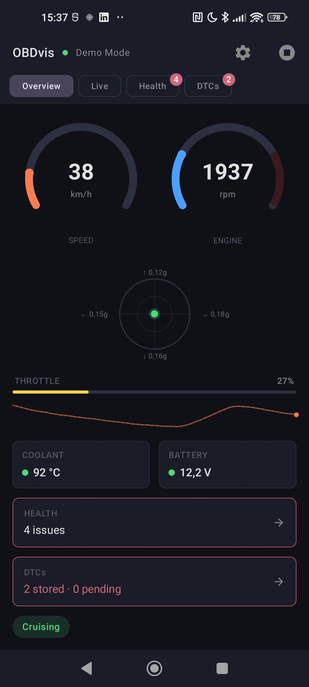
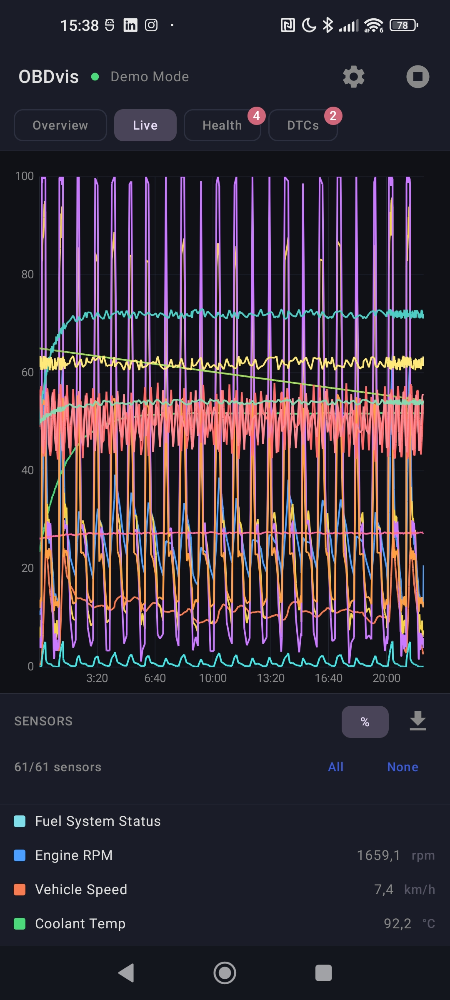
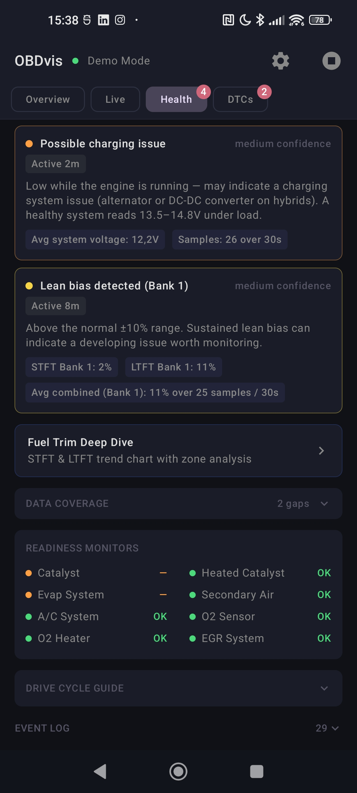
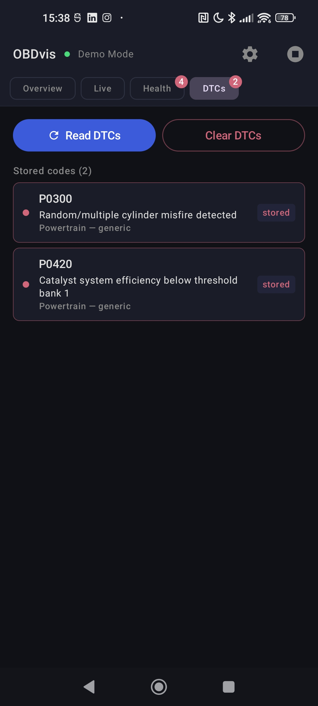

# OBDvis

OBDvis is an Android app for visualising live OBD-II data from an ELM327 Bluetooth adapter.
It provides real-time gauges, charting, diagnostic health checks, DTC reading/clearing, a
post-drive summary, demo mode, and a read-only Android Auto companion surface.

The app is intentionally small in architecture: one Android app module, one activity, Jetpack
Compose UI, Kotlin coroutines/StateFlow, and no third-party architecture framework.

## Screenshots

| Overview | Live chart | Health | DTCs |
|---|---|---|---|
|  |  |  |  |

## Features

- Bluetooth ELM327 connection flow with a built-in demo mode.
- Live OBD-II sensor chart with selectable PIDs and CSV export.
- Overview gauges for RPM, speed, coolant, voltage, vehicle state, and G-force.
- Deterministic vehicle health checks using explicit rules and rolling sensor windows.
- Fuel trim deep dive with short-term and long-term trim trends.
- Stored and pending DTC reading, generic system guidance, user-initiated web search,
  and clear-code confirmation.
- Post-drive summary with peak values and diagnostic finding history.
- Android Auto read-only templates for key sensors and health findings.

## Privacy

The active app processes vehicle data locally on the device. It does not send sensor data,
DTCs, location, or Bluetooth device information to a remote server. See `PRIVACY.md` for
the full privacy note.

## Requirements

- Android Studio Ladybug or newer, or an Android SDK install usable from Gradle.
- JDK 17.
- Android device or emulator with API 23+.
- For real vehicle data: an ELM327-compatible Bluetooth OBD-II adapter.

## Android SDK Setup

Gradle needs to know where your Android SDK is. Android Studio usually creates
`android/local.properties` for you when opening the project. For command-line builds,
set `ANDROID_HOME` or create `android/local.properties` yourself.

Example `android/local.properties` on Windows:

```properties
sdk.dir=C:/Users/YOUR_NAME/AppData/Local/Android/Sdk
```

Example on macOS:

```properties
sdk.dir=/Users/YOUR_NAME/Library/Android/sdk
```

Example on Linux:

```properties
sdk.dir=/home/YOUR_NAME/Android/Sdk
```

`android/local.properties` is intentionally ignored by Git because it contains a
machine-specific path. See `android/local.properties.example`.

## Build

From the repository root:

```powershell
cd android
.\gradlew.bat assembleDebug
```

On macOS/Linux:

```sh
cd android
./gradlew assembleDebug
```

Install the debug build from `android/app/build/outputs/apk/debug/`.

## Tests

```powershell
cd android
.\gradlew.bat test
```

The unit tests cover OBD response parsing, DTC parsing, PID priority scheduling,
rolling sample storage, vehicle state creation, diagnostics interpretation, and
post-drive aggregation.

## Contributing

Contributions are welcome. Please read `CONTRIBUTING.md` before opening an issue
or pull request. Security concerns should be reported privately; see
`SECURITY.md`. Planned directions are tracked in `ROADMAP.md`.

## Project Layout

- `android/app/src/main/java/com/obdvis/android/data/` - Bluetooth and ELM327 command I/O.
- `android/app/src/main/java/com/obdvis/android/domain/` - sessions, PID definitions, polling,
  sample storage, DTC parsing, and diagnostics.
- `android/app/src/main/java/com/obdvis/android/ui/` - Compose screens and chart components.
- `android/app/src/main/java/com/obdvis/android/auto/` - Android Auto read-only templates.
- `android/app/src/test/` - JVM unit tests.

## Safety Note

OBDvis is an informational tool. Diagnostic findings are rule-based hints from available
sensor data, not repair instructions or a certification that a vehicle is safe to drive.
Always follow safe driving practices and consult a qualified technician when needed.

## License

Apache License 2.0. See `LICENSE`.
